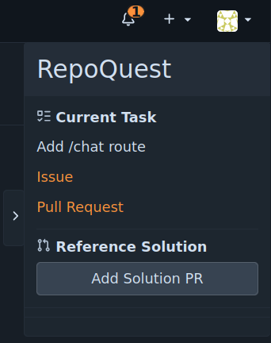

# Using a reference solution

If you require a reference solution for a chapter, press the "Add reference
solution" button in the top right of the quest repository interface. The
reference solution will be added as pull request into the branch for the current
chapter's task.

You can then browse the reference solution or make use of the solution by
merging into the branch for the active chapter's task. If you do so, you will
still need to finish the chapter by merging the task branch into main.

